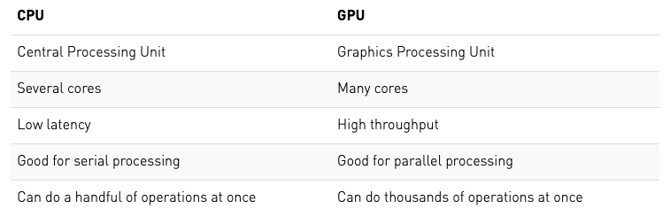

# What is a GPU?

[table](https://blogs.nvidia.com/blog/2009/12/16/whats-the-difference-between-a-cpu-and-a-gpu/)

{:width="80%"}

### AMD vs. NVIDIA

While both AMD and NVIDIA are major vendors of GPUs, NVIDIA is currently the most common GPU vendor for machine learning and cloud computing. Most GPU-enabled Python libraries will only work with NVIDIA GPUs.

# Which Python machine learning libraries support GPUs?

* Tensorflow
* PyTorch
* Keras
* Caffe

An important ML Python library that you may notice is missing from this list is [Scikit-Learn](https://scikit-learn.org/stable/faq.html#will-you-add-gpu-support). Scikit-learn does not support GPU processing at the moment and there are currently no plans to implement support in the near future. Why is this? Well, GPU suport is primarily used for neural networks and deep learning, neither of which are key elements of the Scikit-learn library.

# Why should I use a GPU for my ML code?



