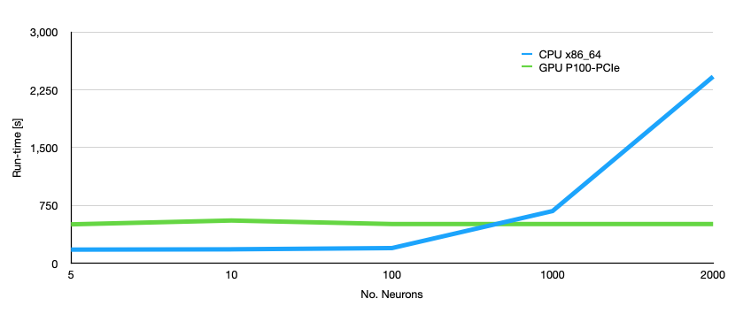

In this lesson we will consider different ways of measuring performance and draw comparisons between training a model on the CPU and training it on the GPU. 

# Model performance

Just as in the [Introduction to Machine Learning lesson](https://hsf-training.github.io/hsf-training-ml-webpage/11-Model_Comparison/index.html) you can evaluate the performance of your network using a variety of metrics. For example using

~~~
from sklearn.metrics import classification_report

print (classification_report(y_test, y_pred,
                            target_names=["background", "signal"]))
~~~
{: .language-python}

However, remember that if you have made your predictions using the model on the GPU then you will need to move the prediction from your network `y_pred` off the GPU and onto the CPU before using the `classification_report()` function.

> ## Challenge
> Check the performance of the model you trained on the GPU and compare it to the same model trained on the CPU.
> 
> > ## Solution
> > You shouldn't see any difference in the performance of the two models. 
> {: .solution}
{: .challenge}

# Computational performance

Although there are different ways to evaluate the computational performance of your code, for the purpose of this tutorial the main metric that you're probably interested in is **run time**. Training machine learning models can take a really long time and speeding this process up makes life much easier.

### Calculating run time

An easy way to determine the run time for a particular section of code is to use the [Python time library](https://docs.python.org/3/library/time.html#time.time). 

~~~
import time
mytime = time.time()
print(mytime)
~~~
{: .language-python}

The `time.time()` function returns the time in seconds since January 1, 1970, 00:00:00 (UTC). By itself it's not always super useful, but for wrapping a piece of code and calculating the elapsed time between the start and end of that code it's a nice and simple method for determining run time.

~~~
import time
start = time.time()

# insert some code to do something here

end = time.time()
print("Run time [s]: ",end-start)
~~~
{: .language-python}

### Timing tests when using a GPU

When we are timing PyTorch processes that use a GPU it's necessary to add one extra line of code into this loop:

~~~
import time
start = time.time()

# insert some code to do something here

if use_cuda: torch.cuda.synchronize()    # <---------------- extra line
end = time.time()
print("Run time [s]: ",end-start)
~~~
{: .language-python}

This is because processes on a GPU run *asynchronously*. This means that when we send a process to the GPU it doesn't necessarily run immediately, instead it joins a queue. By calling the `torch.cuda.synchronize` function before specifying the `end` of our timing test, we can ensure that all of the processes on the GPU have actually run before we calculate the run time. 

> ## Challenge
> Calculate the run time for the GPU-enabled training loop in your code.
> 
> > ## Solution
> > 
> > ~~~
> > model = model.to(device)
> >
> > start = time.time()
> > for batch, (x_train, y_train) in enumerate(train_loader):
> >         
> >         x_train, y_train = x_train.to(device), y_train.to(device)
> >         
> >         model.zero_grad()
> >         pred, prob = model(x_train)
> >         
> >         acc = (prob.argmax(dim=-1) == y_train).to(torch.float32).mean()
> >         train_accs.append(acc.mean().item())
> >         
> >         loss = F.cross_entropy(pred, y_train)
> >         train_loss.append(loss.item())
> >        
> >         loss.backward()
> >         optimizer.step()
> >
> > if use_cuda: torch.cuda.synchronize()    
> > end = time.time()
> > print("Run time [s]: ",end-start)
> > ~~~
> > {: .language-python}
> {: .solution}
{: .challenge}

### Network depth

You'll quickly realise that the GPU-enabled loop doesn't really run that much faster than the normal training on CPU. That's because the neural network we've been using is really really small so the matrix multiplications on the CPU are just as fast as the ones we can do on the GPU. We can see how big our network needs to be to make the GPU useful by increasing the number of artificial neurons in each of our hidden layers. 

{:width="80%"}

> ## Challenge
> Increase the number of neurons in the hidden layers of your network to 5000 and re-run your timing tests. How do the results look now?
> 
> > ## Solution
> > 
> > ~~~
> > hidden_size = 5000
> > ~~~
> > {: .language-python}
> >
> > You should see a difference in run time that is roughly XX. The exact value will depend on what type of GPU you are using.
> {: .solution}
{: .challenge}

